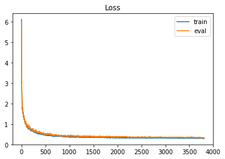
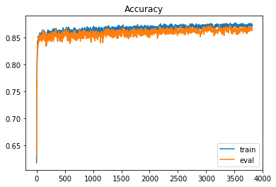

# 作业2-年收入判断

## 项目描述
二元分类是机器学习中最基础的问题之一，在这份教学中，你将学会如何实作一个线性二元分类器，来根据人们的个人资料，判断其年收入是否高于 50,000 美元。我们将以两种方法: logistic regression 与 generative model，来达成以上目的，你可以尝试了解、分析两者的设计理念及差别。
实现二分类任务：
* 个人收入是否超过50000元？

## 数据集介绍
这个资料集是由UCI Machine Learning Repository 的Census-Income (KDD) Data Set 经过一些处理而得来。为了方便训练，我们移除了一些不必要的资讯，并且稍微平衡了正负两种标记的比例。事实上在训练过程中，只有 X_train、Y_train 和 X_test 这三个经过处理的档案会被使用到，train.csv 和 test.csv 这两个原始资料档则可以提供你一些额外的资讯。
* 已经去除不必要的属性。
* 已经平衡正标和负标数据之间的比例。

**特征格式**
1. train.csv，test_no_label.csv。
* 基于文本的原始数据
* 去掉不必要的属性，平衡正负比例。
2. X_train, Y_train, X_test(测试)
* train.csv中的离散特征=>在X_train中onehot编码(学历、状态...)
* train.csv中的连续特征 => 在X_train中保持不变(年龄、资本损失...)。
* X_train, X_test : 每一行包含一个510-dim的特征，代表一个样本。
* Y_train: label = 0 表示 "<=50K" 、 label = 1 表示 " >50K " 。

## 项目要求
1. 请动手编写 gradient descent 实现 logistic regression
1. 请动手实现概率生成模型。
1. 单个代码块运行时长应低于五分钟。
1. 禁止使用任何开源的代码(例如，你在GitHub上找到的决策树的实现)。

## 数据准备
项目数据保存在：work/data/ 目录下。

## 环境配置/安装
无


```python
import pandas as pd
import numpy as np
import matplotlib.pyplot as plt
```


```python
df = pd.read_csv('work/data/train.csv', header=None, encoding='big5')
print(df.shape)
df.head()
```

    (54257, 42)


    /opt/conda/envs/python35-paddle120-env/lib/python3.7/site-packages/IPython/core/interactiveshell.py:3018: DtypeWarning: Columns (0,1,3,4,6,17,18,19,30,36,38,39,40) have mixed types.Specify dtype option on import or set low_memory=False.
      interactivity=interactivity, compiler=compiler, result=result)


<div>
<style scoped>
    .dataframe tbody tr th:only-of-type {
        vertical-align: middle;
    }

    .dataframe tbody tr th {
        vertical-align: top;
    }

    .dataframe thead th {
        text-align: right;
    }
</style>
<table border="1" class="dataframe">
  <thead>
    <tr style="text-align: right;">
      <th></th>
      <th>0</th>
      <th>1</th>
      <th>2</th>
      <th>3</th>
      <th>4</th>
      <th>5</th>
      <th>6</th>
      <th>7</th>
      <th>8</th>
      <th>9</th>
      <th>...</th>
      <th>32</th>
      <th>33</th>
      <th>34</th>
      <th>35</th>
      <th>36</th>
      <th>37</th>
      <th>38</th>
      <th>39</th>
      <th>40</th>
      <th>41</th>
    </tr>
  </thead>
  <tbody>
    <tr>
      <th>0</th>
      <td>id</td>
      <td>age</td>
      <td>class of worker</td>
      <td>detailed industry recode</td>
      <td>detailed occupation recode</td>
      <td>education</td>
      <td>wage per hour</td>
      <td>enroll in edu inst last wk</td>
      <td>marital stat</td>
      <td>major industry code</td>
      <td>...</td>
      <td>country of birth father</td>
      <td>country of birth mother</td>
      <td>country of birth self</td>
      <td>citizenship</td>
      <td>own business or self employed</td>
      <td>fill inc questionnaire for veteran's admin</td>
      <td>veterans benefits</td>
      <td>weeks worked in year</td>
      <td>year</td>
      <td>y</td>
    </tr>
    <tr>
      <th>1</th>
      <td>0</td>
      <td>33</td>
      <td>Private</td>
      <td>34</td>
      <td>26</td>
      <td>Masters degree(MA MS MEng MEd MSW MBA)</td>
      <td>0</td>
      <td>Not in universe</td>
      <td>Married-civilian spouse present</td>
      <td>Finance insurance and real estate</td>
      <td>...</td>
      <td>China</td>
      <td>China</td>
      <td>Taiwan</td>
      <td>Foreign born- Not a citizen of U S</td>
      <td>2</td>
      <td>Not in universe</td>
      <td>2</td>
      <td>52</td>
      <td>95</td>
      <td>50000+.</td>
    </tr>
    <tr>
      <th>2</th>
      <td>1</td>
      <td>63</td>
      <td>Private</td>
      <td>7</td>
      <td>22</td>
      <td>Some college but no degree</td>
      <td>0</td>
      <td>Not in universe</td>
      <td>Never married</td>
      <td>Manufacturing-durable goods</td>
      <td>...</td>
      <td>?</td>
      <td>?</td>
      <td>United-States</td>
      <td>Native- Born in the United States</td>
      <td>0</td>
      <td>Not in universe</td>
      <td>2</td>
      <td>52</td>
      <td>95</td>
      <td>- 50000.</td>
    </tr>
    <tr>
      <th>3</th>
      <td>2</td>
      <td>71</td>
      <td>Not in universe</td>
      <td>0</td>
      <td>0</td>
      <td>7th and 8th grade</td>
      <td>0</td>
      <td>Not in universe</td>
      <td>Married-civilian spouse present</td>
      <td>Not in universe or children</td>
      <td>...</td>
      <td>Germany</td>
      <td>United-States</td>
      <td>United-States</td>
      <td>Native- Born in the United States</td>
      <td>0</td>
      <td>Not in universe</td>
      <td>2</td>
      <td>0</td>
      <td>95</td>
      <td>- 50000.</td>
    </tr>
    <tr>
      <th>4</th>
      <td>3</td>
      <td>43</td>
      <td>Local government</td>
      <td>43</td>
      <td>10</td>
      <td>Bachelors degree(BA AB BS)</td>
      <td>0</td>
      <td>Not in universe</td>
      <td>Married-civilian spouse present</td>
      <td>Education</td>
      <td>...</td>
      <td>United-States</td>
      <td>United-States</td>
      <td>United-States</td>
      <td>Native- Born in the United States</td>
      <td>0</td>
      <td>Not in universe</td>
      <td>2</td>
      <td>52</td>
      <td>95</td>
      <td>- 50000.</td>
    </tr>
  </tbody>
</table>
<p>5 rows × 42 columns</p>
</div>


```python
df = pd.read_csv('work/data/X_train', header=None, encoding='big5')
print(df.shape)
df.head()
```

    /opt/conda/envs/python35-paddle120-env/lib/python3.7/site-packages/IPython/core/interactiveshell.py:3018: DtypeWarning: Columns (0,1,2,3,4,5,6,7,8,9,10,110,111,112,113,114,115,116,117,118,119,120,121,122,123,124,125,126,127,128,129,130,131,132,133,134,135,136,137,138,139,140,141,142,143,144,145,146,147,148,149,150,151,152,153,154,155,156,157,158,159,160,161,162,163,164,165,166,167,168,169,170,171,172,173,174,175,176,177,178,179,180,181,182,183,184,185,186,187,188,189,190,191,192,193,194,195,196,197,198,199,200,201,202,203,204,205,206,207,208,209,210,211,212,213,214,215,216,217,218,219,220,221,222,223,224,225,226,227,228,229,230,231,232,233,234,235,236,237,238,239,240,241,242,243,244,245,246,247,248,249,250,251,252,253,254,255,256,257,258,259,260,261,262,263,264,265,266,267,268,269,270,271,272,273,274,275,276,277,278,279,280,281,282,283,284,285,286,287,288,289,290,291,292,293,294,295,296,297,298,299,300,301,302,303,304,305,306,307,308,309,310,311,312,313,314,315,316,317,318,319,320,321,322,323,324,325,326,327,328,329,330,331,332,333,334,335,336,337,338,339,340,341,342,343,344,345,346,347,348,349,350,351,352,353,354,355,356,357,358,359,360,361,362,363,364,365,366,367,368,369,370,371,372,373,374,375,376,377,378,379,380,381,382,383,384,385,386,387,388,389,390,391,392,393,394,395,396,397,398,399,400,401,402,403,404,405,406,407,408,409,410,411,412,413,414,415,416,417,418,419,420,421,422,423,424,425,426,427,428,429,430,431,432,433,434,435,436,437,438,439,440,441,442,443,444,445,446,447,448,449,450,451,452,453,454,455,456,457,458,459,460,461,462,463,464,465,466,467,468,469,470,471,472,473,474,475,476,477,478,479,480,481,482,483,484,485,486,487,488,489,490,491,492,493,494,495,496,497,498,502,503,504,508) have mixed types.Specify dtype option on import or set low_memory=False.
      interactivity=interactivity, compiler=compiler, result=result)


    (54257, 511)


<div>
<style scoped>
    .dataframe tbody tr th:only-of-type {
        vertical-align: middle;
    }

    .dataframe tbody tr th {
        vertical-align: top;
    }

    .dataframe thead th {
        text-align: right;
    }
</style>
<table border="1" class="dataframe">
  <thead>
    <tr style="text-align: right;">
      <th></th>
      <th>0</th>
      <th>1</th>
      <th>2</th>
      <th>3</th>
      <th>4</th>
      <th>5</th>
      <th>6</th>
      <th>7</th>
      <th>8</th>
      <th>9</th>
      <th>...</th>
      <th>501</th>
      <th>502</th>
      <th>503</th>
      <th>504</th>
      <th>505</th>
      <th>506</th>
      <th>507</th>
      <th>508</th>
      <th>509</th>
      <th>510</th>
    </tr>
  </thead>
  <tbody>
    <tr>
      <th>0</th>
      <td>id</td>
      <td>age</td>
      <td>Private</td>
      <td>Self-employed-incorporated</td>
      <td>State government</td>
      <td>Self-employed-not incorporated</td>
      <td>Not in universe</td>
      <td>Without pay</td>
      <td>Federal government</td>
      <td>Never worked</td>
      <td>...</td>
      <td>1</td>
      <td>Not in universe</td>
      <td>Yes</td>
      <td>No</td>
      <td>2</td>
      <td>0</td>
      <td>1</td>
      <td>weeks worked in year</td>
      <td>94</td>
      <td>95</td>
    </tr>
    <tr>
      <th>1</th>
      <td>0</td>
      <td>33</td>
      <td>1</td>
      <td>0</td>
      <td>0</td>
      <td>0</td>
      <td>0</td>
      <td>0</td>
      <td>0</td>
      <td>0</td>
      <td>...</td>
      <td>0</td>
      <td>1</td>
      <td>0</td>
      <td>0</td>
      <td>1</td>
      <td>0</td>
      <td>0</td>
      <td>52</td>
      <td>0</td>
      <td>1</td>
    </tr>
    <tr>
      <th>2</th>
      <td>1</td>
      <td>63</td>
      <td>1</td>
      <td>0</td>
      <td>0</td>
      <td>0</td>
      <td>0</td>
      <td>0</td>
      <td>0</td>
      <td>0</td>
      <td>...</td>
      <td>0</td>
      <td>1</td>
      <td>0</td>
      <td>0</td>
      <td>1</td>
      <td>0</td>
      <td>0</td>
      <td>52</td>
      <td>0</td>
      <td>1</td>
    </tr>
    <tr>
      <th>3</th>
      <td>2</td>
      <td>71</td>
      <td>0</td>
      <td>0</td>
      <td>0</td>
      <td>0</td>
      <td>1</td>
      <td>0</td>
      <td>0</td>
      <td>0</td>
      <td>...</td>
      <td>0</td>
      <td>1</td>
      <td>0</td>
      <td>0</td>
      <td>1</td>
      <td>0</td>
      <td>0</td>
      <td>0</td>
      <td>0</td>
      <td>1</td>
    </tr>
    <tr>
      <th>4</th>
      <td>3</td>
      <td>43</td>
      <td>0</td>
      <td>0</td>
      <td>0</td>
      <td>0</td>
      <td>0</td>
      <td>0</td>
      <td>0</td>
      <td>0</td>
      <td>...</td>
      <td>0</td>
      <td>1</td>
      <td>0</td>
      <td>0</td>
      <td>1</td>
      <td>0</td>
      <td>0</td>
      <td>52</td>
      <td>0</td>
      <td>1</td>
    </tr>
  </tbody>
</table>
<p>5 rows × 511 columns</p>
</div>


## Preparing Data
对属性进行正则化，处理过后划分为训练集和验证集


```python
np.random.seed(0)
X_train_fpath = 'work/data/X_train'
Y_train_fpath = 'work/data/Y_train'
X_test_fpath = 'work/data/X_test'
output_fpath = 'work/output_{}.csv'

# Parse csv files to numpy array
with open(X_train_fpath) as f:
    next(f)
    X_train = np.array([line.strip('\n').split(',')[1:] for line in f], dtype = float)
with open(Y_train_fpath) as f:
    next(f)
    Y_train = np.array([line.strip('\n').split(',')[1] for line in f], dtype = float)
with open(X_test_fpath) as f:
    next(f)
    X_test = np.array([line.strip('\n').split(',')[1:] for line in f], dtype = float)

# 规范化
def _normalize(X, train = True, specified_column = None, X_mean = None, X_std = None):
    # This function normalizes specific columns of X.
    # The mean and standard variance of training data will be reused when processing testing data.
    #
    # Arguments:
    #     X: data to be processed
    #     train: 'True' when processing training data, 'False' for testing data
    #     specific_column: indexes of the columns that will be normalized. If 'None', all columns
    #         will be normalized.
    #     X_mean: mean value of training data, used when train = 'False'
    #     X_std: standard deviation of training data, used when train = 'False'
    # Outputs:
    #     X: normalized data
    #     X_mean: computed mean value of training data
    #     X_std: computed standard deviation of training data

    if specified_column == None:
        specified_column = np.arange(X.shape[1])
    if train:
        X_mean = np.mean(X[:, specified_column] ,0).reshape(1, -1)
        X_std  = np.std(X[:, specified_column], 0).reshape(1, -1)

    X[:,specified_column] = (X[:, specified_column] - X_mean) / (X_std + 1e-8)
     
    return X, X_mean, X_std

def _train_dev_split(X, Y, dev_ratio = 0.25):
    # This function spilts data into training set and development set.
    train_size = int(len(X) * (1 - dev_ratio))
    return X[:train_size], Y[:train_size], X[train_size:], Y[train_size:]

# Normalize training and testing data
X_train, X_mean, X_std = _normalize(X_train, train = True)
X_test, _, _ = _normalize(X_test, train = False, specified_column = None, X_mean = X_mean, X_std = X_std)
    
# Split data into training set and development set
dev_ratio = 0.1
# 9:1
X_train, Y_train, X_eval, Y_eval = _train_dev_split(X_train, Y_train, dev_ratio = dev_ratio)

train_size = X_train.shape[0]
eval_size = X_eval.shape[0]
test_size = X_test.shape[0]
data_dim = X_train.shape[1]

print('Size of training set: {}'.format(X_train.shape[0]))
print('Size of eval set: {}'.format(X_eval.shape[0]))
print('Size of testing set: {}'.format(X_test.shape[0]))
print('Dimension of data: {}'.format(data_dim))
```

    Size of training set: 48830
    Size of eval set: 5426
    Size of testing set: 27622
    Dimension of data: 510


## Some Useful Functions


```python
def _shuffle(X, Y):
    # This function shuffles two equal-length list/array, X and Y, together.
    randomize = np.arange(len(X))
    np.random.shuffle(randomize)
    return (X[randomize], Y[randomize])

def _sigmoid(z):
    # Sigmoid function can be used to calculate probability.
    # To avoid overflow, minimum/maximum output value is set.
    return np.clip(1 / (1.0 + np.exp(-z)), 1e-8, 1 - (1e-8))

def _f(X, w, b):
    # This is the logistic regression function, parameterized by w and b
    #
    # Arguements:
    #     X: input data, shape = [batch_size, data_dimension]
    #     w: weight vector, shape = [data_dimension, ]
    #     b: bias, scalar
    # Output:
    #     predicted probability of each row of X being positively labeled, shape = [batch_size, ]
    return _sigmoid(np.matmul(X, w) + b)

def _predict(X, w, b):
    # This function returns a truth value prediction for each row of X 
    # by rounding the result of logistic regression function.
    return np.round(_f(X, w, b)).astype(np.int)
    
def _accuracy(Y_pred, Y_label):
    # This function calculates prediction accuracy
    acc = 1 - np.mean(np.abs(Y_pred - Y_label))
    return acc
```

## Functions about gradient and loss


```python
# 交叉熵损失 if 0-1损失 第二项为0
def _cross_entropy_loss(y_pred, Y_label):
    # This function computes the cross entropy.
    #
    # Arguements:
    #     y_pred: probabilistic predictions, float vector
    #     Y_label: ground truth labels, bool vector
    # Output:
    #     cross entropy, scalar
    cross_entropy = -np.dot(Y_label, np.log(y_pred)) - np.dot((1 - Y_label), np.log(1 - y_pred))
    return cross_entropy

# 
def _gradient(X, Y_label, w, b):
    # This function computes the gradient of cross entropy loss with respect to weight w and bias b.
    y_pred = _f(X, w, b)
    pred_error = Y_label - y_pred
    w_grad = -np.sum(pred_error * X.T, 1)
    b_grad = -np.sum(pred_error)
    return w_grad, b_grad
```

## Trainning
`Mini-batch`


```python
# Zero initialization for weights ans bias
w = np.zeros((data_dim, )) 
b = np.zeros((1,))

# Some parameters for training    
EPOCH = 10
batch_size = 128
learning_rate = 0.2

# Keep the loss and accuracy at every iteration for plotting
train_loss = []
eval_loss = []
train_acc = []
eval_acc = []

# Calcuate the number of parameter updates
adagrad_step = 1
batch_step = 0
# Iterative training
for epoch in range(EPOCH):
    # Random shuffle at the begging of each epoch
    X_train, Y_train = _shuffle(X_train, Y_train)
        
    # Mini-batch training
    step = 0
    steps = int(np.floor(train_size / batch_size))
    for idx in range(steps):  # floor(48830/128)=382
        X = X_train[idx*batch_size:(idx+1)*batch_size]
        Y = Y_train[idx*batch_size:(idx+1)*batch_size]

        # Compute the gradient
        w_grad, b_grad = _gradient(X, Y, w, b)
            
        # gradient descent update
        # learning rate decay with time
        w = w - learning_rate/np.sqrt(adagrad_step) * w_grad
        b = b - learning_rate/np.sqrt(adagrad_step) * b_grad
        
        step += 1
        adagrad_step += 1

        # Compute loss and accuracy of training set and development set
        y_train_pred = _f(X_train, w, b)
        Y_train_pred = np.round(y_train_pred)
        y_eval_pred = _f(X_eval, w, b)
        Y_eval_pred = np.round(y_eval_pred)

        acc_train = _accuracy(Y_train_pred, Y_train)
        loss_train = _cross_entropy_loss(y_train_pred, Y_train) / train_size
        acc_eval = _accuracy(Y_eval_pred, Y_eval)
        loss_eval = _cross_entropy_loss(y_eval_pred, Y_eval) / eval_size

        if step % 50 == 0 or step == steps:
            print(f'Epoch {epoch}/{EPOCH}, step {step}/{steps} : train_loss = {loss_train}, train_acc = {acc_train}, eval_loss = {loss_eval}, eval_acc = {acc_eval}')

        train_acc.append(acc_train)
        train_loss.append(loss_train)
        eval_acc.append(acc_eval)
        eval_loss.append(loss_eval)

print('Training loss: {}'.format(train_loss[-1]))
print('Eval loss: {}'.format(eval_loss[-1]))
print('Training accuracy: {}'.format(train_acc[-1]))
print('Eval accuracy: {}'.format(eval_acc[-1]))
```

    Epoch 0/10, step 50/381 : train_loss = 1.347386236965906, train_acc = 0.8488224452181037, eval_loss = 1.400598892932686, eval_acc = 0.8518245484703281


    /opt/conda/envs/python35-paddle120-env/lib/python3.7/site-packages/ipykernel_launcher.py:10: RuntimeWarning: overflow encountered in exp
      # Remove the CWD from sys.path while we load stuff.


    Epoch 0/10, step 100/381 : train_loss = 0.9152016432029676, train_acc = 0.8617857874257628, eval_loss = 0.965991675211801, eval_acc = 0.8558791006266127
    Epoch 0/10, step 150/381 : train_loss = 0.7852583061703493, train_acc = 0.8539627278312513, eval_loss = 0.8467023409488244, eval_acc = 0.8497972723921858
    Epoch 0/10, step 200/381 : train_loss = 0.6855500080014343, train_acc = 0.8627687896784764, eval_loss = 0.7420444348505428, eval_acc = 0.8510873571691854
    Epoch 0/10, step 250/381 : train_loss = 0.6626799916718044, train_acc = 0.8518533688306369, eval_loss = 0.6843539759344478, eval_acc = 0.8462956137117582
    Epoch 0/10, step 300/381 : train_loss = 0.6722368835334585, train_acc = 0.850419823878763, eval_loss = 0.7212556694191992, eval_acc = 0.8431625506819019
    Epoch 0/10, step 350/381 : train_loss = 0.5415013375184299, train_acc = 0.8645095228343231, eval_loss = 0.5956548816527707, eval_acc = 0.8534832288978991
    Epoch 0/10, step 380/381 : train_loss = 0.5476793641705842, train_acc = 0.8615605160761827, eval_loss = 0.5971872765737423, eval_acc = 0.8573534832288979
    Epoch 1/10, step 50/381 : train_loss = 0.520197120568741, train_acc = 0.8530821216465287, eval_loss = 0.5756371351198375, eval_acc = 0.8475856984887579
    Epoch 1/10, step 100/381 : train_loss = 0.4683572388702472, train_acc = 0.8602498464058981, eval_loss = 0.5151070012119039, eval_acc = 0.8496129745669001
    Epoch 1/10, step 150/381 : train_loss = 0.44626484885429574, train_acc = 0.8692607003891051, eval_loss = 0.4765391936828192, eval_acc = 0.8650939918908958
    Epoch 1/10, step 200/381 : train_loss = 0.46375217192688756, train_acc = 0.8594921155027647, eval_loss = 0.5209083007160215, eval_acc = 0.852930335422042
    Epoch 1/10, step 250/381 : train_loss = 0.4494819665359848, train_acc = 0.8585910301044439, eval_loss = 0.4937525184406186, eval_acc = 0.8516402506450425
    Epoch 1/10, step 300/381 : train_loss = 0.42552905318999246, train_acc = 0.8556010649191071, eval_loss = 0.45717340275441076, eval_acc = 0.8514559528197567
    Epoch 1/10, step 350/381 : train_loss = 0.42113694236968163, train_acc = 0.8607823059594512, eval_loss = 0.46348429781456685, eval_acc = 0.852930335422042
    Epoch 1/10, step 380/381 : train_loss = 0.39904321655303177, train_acc = 0.8648986278926889, eval_loss = 0.4248971078552518, eval_acc = 0.86490969406561
    Epoch 2/10, step 50/381 : train_loss = 0.4346224720366914, train_acc = 0.8548023755887774, eval_loss = 0.4609538098915485, eval_acc = 0.8485071876151862
    Epoch 2/10, step 100/381 : train_loss = 0.3923956025090415, train_acc = 0.8670079868933033, eval_loss = 0.42413396929246294, eval_acc = 0.8586435680058975
    Epoch 2/10, step 150/381 : train_loss = 0.3995503389795209, train_acc = 0.8609870980954332, eval_loss = 0.4451562989979174, eval_acc = 0.8499815702174714
    Epoch 2/10, step 200/381 : train_loss = 0.3899945539693655, train_acc = 0.8572803604341593, eval_loss = 0.43982862908042286, eval_acc = 0.8440840398083302
    Epoch 2/10, step 250/381 : train_loss = 0.3593450339469139, train_acc = 0.8709809543313537, eval_loss = 0.40433358814068665, eval_acc = 0.8604865462587541
    Epoch 2/10, step 300/381 : train_loss = 0.3748111111601529, train_acc = 0.8675199672332583, eval_loss = 0.4196960003401859, eval_acc = 0.8617766310357537
    Epoch 2/10, step 350/381 : train_loss = 0.3703513254990469, train_acc = 0.8669260700389105, eval_loss = 0.41804964042741555, eval_acc = 0.8520088462956137
    Epoch 2/10, step 380/381 : train_loss = 0.36328355503504767, train_acc = 0.8688306369035429, eval_loss = 0.395140184186746, eval_acc = 0.8608551419093254
    Epoch 3/10, step 50/381 : train_loss = 0.3667617885217751, train_acc = 0.8671308621748925, eval_loss = 0.40048983606743443, eval_acc = 0.8604865462587541
    Epoch 3/10, step 100/381 : train_loss = 0.35360533975074676, train_acc = 0.8685644071267663, eval_loss = 0.39086426288977333, eval_acc = 0.8650939918908958
    Epoch 3/10, step 150/381 : train_loss = 0.35412973445213575, train_acc = 0.8656563587958223, eval_loss = 0.39303244637743845, eval_acc = 0.8584592701806119
    Epoch 3/10, step 200/381 : train_loss = 0.3590742324953709, train_acc = 0.8645709604751177, eval_loss = 0.3944381871174818, eval_acc = 0.8617766310357537
    Epoch 3/10, step 250/381 : train_loss = 0.3664068327141785, train_acc = 0.8649805447470817, eval_loss = 0.4009416310136879, eval_acc = 0.854036122373756
    Epoch 3/10, step 300/381 : train_loss = 0.35723431597516137, train_acc = 0.8696498054474708, eval_loss = 0.39744904200659437, eval_acc = 0.8569848875783266
    Epoch 3/10, step 350/381 : train_loss = 0.3524748289033771, train_acc = 0.8708785582633627, eval_loss = 0.3854558575255915, eval_acc = 0.8625138223368964
    Epoch 3/10, step 380/381 : train_loss = 0.3590500094054613, train_acc = 0.8656768380094204, eval_loss = 0.38422321854508834, eval_acc = 0.8617766310357537
    Epoch 4/10, step 50/381 : train_loss = 0.36264869668435873, train_acc = 0.8653286913782511, eval_loss = 0.39855663300624034, eval_acc = 0.85514190932547
    Epoch 4/10, step 100/381 : train_loss = 0.3604975080000873, train_acc = 0.8658816301454024, eval_loss = 0.4105462641088316, eval_acc = 0.8553262071507556
    Epoch 4/10, step 150/381 : train_loss = 0.3564967782256114, train_acc = 0.8667007986893304, eval_loss = 0.39057223845742817, eval_acc = 0.8595650571323259
    Epoch 4/10, step 200/381 : train_loss = 0.3527179993831093, train_acc = 0.8693630964570961, eval_loss = 0.3858817452121384, eval_acc = 0.8647253962403243
    Epoch 4/10, step 250/381 : train_loss = 0.36648828966601643, train_acc = 0.8644480851935286, eval_loss = 0.41029858763804716, eval_acc = 0.8568005897530409
    Epoch 4/10, step 300/381 : train_loss = 0.351422769480477, train_acc = 0.8657177964366168, eval_loss = 0.39303785532877383, eval_acc = 0.8590121636564688
    Epoch 4/10, step 350/381 : train_loss = 0.3687938519023856, train_acc = 0.8581609666188819, eval_loss = 0.40015912716296487, eval_acc = 0.8569848875783266
    Epoch 4/10, step 380/381 : train_loss = 0.3420811103956837, train_acc = 0.8683800942043826, eval_loss = 0.3751930193928467, eval_acc = 0.8579063767047549
    Epoch 5/10, step 50/381 : train_loss = 0.3302270800745182, train_acc = 0.8689944706123285, eval_loss = 0.36852577788742297, eval_acc = 0.8556948028013269
    Epoch 5/10, step 100/381 : train_loss = 0.34052478475076675, train_acc = 0.8683800942043826, eval_loss = 0.37442216550948215, eval_acc = 0.8612237375598968
    Epoch 5/10, step 150/381 : train_loss = 0.3405981277637372, train_acc = 0.8697522015154618, eval_loss = 0.3723756076252314, eval_acc = 0.8641725027644673
    Epoch 5/10, step 200/381 : train_loss = 0.3474172130238929, train_acc = 0.8686463239811592, eval_loss = 0.3986964140186972, eval_acc = 0.867121267969038
    Epoch 5/10, step 250/381 : train_loss = 0.340855490401304, train_acc = 0.8665369649805448, eval_loss = 0.3879554496988832, eval_acc = 0.8573534832288979
    Epoch 5/10, step 300/381 : train_loss = 0.33366211362426634, train_acc = 0.8697112430882654, eval_loss = 0.36908480221109613, eval_acc = 0.8638039071138961
    Epoch 5/10, step 350/381 : train_loss = 0.32117517430525355, train_acc = 0.8744009830022528, eval_loss = 0.3645435168908827, eval_acc = 0.8623295245116107
    Epoch 5/10, step 380/381 : train_loss = 0.33272551587770516, train_acc = 0.8721073110792545, eval_loss = 0.361574603657775, eval_acc = 0.8647253962403243
    Epoch 6/10, step 50/381 : train_loss = 0.3456555960901342, train_acc = 0.8687077616219537, eval_loss = 0.374727342928016, eval_acc = 0.8580906745300405
    Epoch 6/10, step 100/381 : train_loss = 0.32195130178615045, train_acc = 0.873499897603932, eval_loss = 0.3622769702037688, eval_acc = 0.8658311831920383
    Epoch 6/10, step 150/381 : train_loss = 0.3388200696217158, train_acc = 0.8667007986893304, eval_loss = 0.37159536068205357, eval_acc = 0.8588278658311832
    Epoch 6/10, step 200/381 : train_loss = 0.3238163382581627, train_acc = 0.8731517509727627, eval_loss = 0.35688837110036886, eval_acc = 0.8614080353851825
    Epoch 6/10, step 250/381 : train_loss = 0.32691372511044997, train_acc = 0.8699569936514437, eval_loss = 0.3591479516184065, eval_acc = 0.8636196092886104
    Epoch 6/10, step 300/381 : train_loss = 0.32754231352360025, train_acc = 0.8680524267868114, eval_loss = 0.3682663327740257, eval_acc = 0.8603022484334685
    Epoch 6/10, step 350/381 : train_loss = 0.3258001611755046, train_acc = 0.8682367397091951, eval_loss = 0.3677240242315396, eval_acc = 0.8579063767047549
    Epoch 6/10, step 380/381 : train_loss = 0.32816830642216066, train_acc = 0.8693835756706942, eval_loss = 0.36171645748448766, eval_acc = 0.867121267969038
    Epoch 7/10, step 50/381 : train_loss = 0.3175343573623028, train_acc = 0.873499897603932, eval_loss = 0.356350794456304, eval_acc = 0.8691485440471802
    Epoch 7/10, step 100/381 : train_loss = 0.3220009954877125, train_acc = 0.8744419414294491, eval_loss = 0.358727432415702, eval_acc = 0.8634353114633248
    Epoch 7/10, step 150/381 : train_loss = 0.3305955213903524, train_acc = 0.8686668031947573, eval_loss = 0.35746500804141423, eval_acc = 0.8591964614817545
    Epoch 7/10, step 200/381 : train_loss = 0.32302814029642124, train_acc = 0.872250665574442, eval_loss = 0.36488833884672156, eval_acc = 0.8625138223368964
    Epoch 7/10, step 250/381 : train_loss = 0.32025796652922844, train_acc = 0.8705304116321934, eval_loss = 0.36008253698973786, eval_acc = 0.8625138223368964
    Epoch 7/10, step 300/381 : train_loss = 0.3219910089368282, train_acc = 0.8729674380503789, eval_loss = 0.34953452123180245, eval_acc = 0.8656468853667527
    Epoch 7/10, step 350/381 : train_loss = 0.3208580070705966, train_acc = 0.8721073110792545, eval_loss = 0.35206761035830214, eval_acc = 0.8643568005897531
    Epoch 7/10, step 380/381 : train_loss = 0.31430803053171624, train_acc = 0.8733565431087447, eval_loss = 0.3442739956568529, eval_acc = 0.8656468853667527
    Epoch 8/10, step 50/381 : train_loss = 0.3314301109448099, train_acc = 0.8662912144173663, eval_loss = 0.3676573957819751, eval_acc = 0.8625138223368964
    Epoch 8/10, step 100/381 : train_loss = 0.3255758437986244, train_acc = 0.868216260495597, eval_loss = 0.35753417552492195, eval_acc = 0.8571691854036122
    Epoch 8/10, step 150/381 : train_loss = 0.31674989040755525, train_acc = 0.8749948801966004, eval_loss = 0.3516086430321963, eval_acc = 0.8614080353851825
    Epoch 8/10, step 200/381 : train_loss = 0.3169229965409289, train_acc = 0.8708785582633627, eval_loss = 0.34929559101057905, eval_acc = 0.866015481017324
    Epoch 8/10, step 250/381 : train_loss = 0.3125736564369679, train_acc = 0.8729879172639771, eval_loss = 0.3558988059234633, eval_acc = 0.8601179506081829
    Epoch 8/10, step 300/381 : train_loss = 0.32465507233694585, train_acc = 0.8700593897194348, eval_loss = 0.35194439521460325, eval_acc = 0.8643568005897531
    Epoch 8/10, step 350/381 : train_loss = 0.321653732112893, train_acc = 0.8695064509522834, eval_loss = 0.3536633993686226, eval_acc = 0.8614080353851825
    Epoch 8/10, step 380/381 : train_loss = 0.3102755524934392, train_acc = 0.8753225476141716, eval_loss = 0.3415885759753436, eval_acc = 0.8687799483966089
    Epoch 9/10, step 50/381 : train_loss = 0.3220828398108354, train_acc = 0.8705099324185951, eval_loss = 0.3526815872306161, eval_acc = 0.8604865462587541
    Epoch 9/10, step 100/381 : train_loss = 0.31449065997699305, train_acc = 0.875158713905386, eval_loss = 0.35772978090131086, eval_acc = 0.866015481017324
    Epoch 9/10, step 150/381 : train_loss = 0.3141249146891724, train_acc = 0.8734589391767356, eval_loss = 0.3482849607567331, eval_acc = 0.8678584592701806
    Epoch 9/10, step 200/381 : train_loss = 0.31630341261673267, train_acc = 0.8709809543313537, eval_loss = 0.3457003170478517, eval_acc = 0.8663840766678953
    Epoch 9/10, step 250/381 : train_loss = 0.3165078699037002, train_acc = 0.8719844357976654, eval_loss = 0.3381895066522098, eval_acc = 0.8691485440471802
    Epoch 9/10, step 300/381 : train_loss = 0.3211023733500236, train_acc = 0.868851116117141, eval_loss = 0.3509102642777991, eval_acc = 0.8599336527828971
    Epoch 9/10, step 350/381 : train_loss = 0.3133905152466426, train_acc = 0.8736842105263158, eval_loss = 0.33751488580315897, eval_acc = 0.8650939918908958
    Epoch 9/10, step 380/381 : train_loss = 0.314415715887756, train_acc = 0.8699160352242474, eval_loss = 0.34212073630604034, eval_acc = 0.8632510136380391
    Training loss: 0.31723862821153564
    Eval loss: 0.34562381603010406
    Training accuracy: 0.8690559082531231
    Eval accuracy: 0.8626981201621821


## Plotting Loss and accuracy curve


```python
# Loss curve
# plt.figure(figsize=(16, 8))
plt.plot(train_loss)
plt.plot(eval_loss)
plt.title('Loss')
plt.legend(['train', 'eval'])
plt.savefig('loss.png')
plt.show()

# Accuracy curve
# plt.figure(figsize=(16, 8))
plt.plot(train_acc)
plt.plot(eval_acc)
plt.title('Accuracy')
plt.legend(['train', 'eval'])
plt.savefig('acc.png')
plt.show()
```








## Predicting testing labels
输出到`output_logistic.csv`。


```python
# Predict testing labels
predictions = _predict(X_test, w, b)
with open(output_fpath.format('logistic'), 'w') as f:
    f.write('id,label\n')
    for i, label in  enumerate(predictions):
        f.write('{},{}\n'.format(i, label))

# Print out the most significant weights
ind = np.argsort(np.abs(w))[::-1]
with open(X_test_fpath) as f:
    content = f.readline().strip('\n').split(',')
features = np.array(content)
for i in ind[0:10]:
    print(features[i], w[i])
```

     Local government -5.370818305378536
     Other Rel 18+ ever marr RP of subfamily -4.303398837549008
    num persons worked for employer 4.177335768723998
     Neither parent present -3.8146477310419447
    dividends from stocks -3.6462348599573593
     2 -3.492485219117511
     High school graduate -3.486094628398619
     Child under 18 ever married -3.405443955741911
     Grandchild 18+ never marr RP of subfamily -3.331278619262018
     Philippines -3.304985181079396


    /opt/conda/envs/python35-paddle120-env/lib/python3.7/site-packages/ipykernel_launcher.py:10: RuntimeWarning: overflow encountered in exp
      # Remove the CWD from sys.path while we load stuff.


# Porbabilistic generative model

## Preparing Data 


```python
# Parse csv files to numpy array
with open(X_train_fpath) as f:
    next(f)
    X_train = np.array([line.strip('\n').split(',')[1:] for line in f], dtype = float)
with open(Y_train_fpath) as f:
    next(f)
    Y_train = np.array([line.strip('\n').split(',')[1] for line in f], dtype = float)
with open(X_test_fpath) as f:
    next(f)
    X_test = np.array([line.strip('\n').split(',')[1:] for line in f], dtype = float)

# Normalize training and testing data
X_train, X_mean, X_std = _normalize(X_train, train = True)
X_test, _, _= _normalize(X_test, train = False, specified_column = None, X_mean = X_mean, X_std = X_std)
```

## Mean and Covariance


```python
# Compute in-class mean
X_train_0 = np.array([x for x, y in zip(X_train, Y_train) if y == 0])
X_train_1 = np.array([x for x, y in zip(X_train, Y_train) if y == 1])

mean_0 = np.mean(X_train_0, axis = 0)
mean_1 = np.mean(X_train_1, axis = 0)  

# Compute in-class covariance
cov_0 = np.zeros((data_dim, data_dim))
cov_1 = np.zeros((data_dim, data_dim))

for x in X_train_0:
    cov_0 += np.dot(np.transpose([x - mean_0]), [x - mean_0]) / X_train_0.shape[0]
for x in X_train_1:
    cov_1 += np.dot(np.transpose([x - mean_1]), [x - mean_1]) / X_train_1.shape[0]

# Shared covariance is taken as a weighted average of individual in-class covariance.
cov = (cov_0 * X_train_0.shape[0] + cov_1 * X_train_1.shape[0]) / (X_train_0.shape[0] + X_train_1.shape[0])
```

## Computing weights and bias


```python
# Compute inverse of covariance matrix.
# Since covariance matrix may be nearly singular, np.linalg.inv() may give a large numerical error.
# Via SVD decomposition, one can get matrix inverse efficiently and accurately.
u, s, v = np.linalg.svd(cov, full_matrices=False)
inv = np.matmul(v.T * 1 / s, u.T)

# Directly compute weights and bias
w = np.dot(inv, mean_0 - mean_1)
b =  (-0.5) * np.dot(mean_0, np.dot(inv, mean_0)) + 0.5 * np.dot(mean_1, np.dot(inv, mean_1))\
    + np.log(float(X_train_0.shape[0]) / X_train_1.shape[0]) 

# Compute accuracy on training set
Y_train_pred = 1 - _predict(X_train, w, b)
print('Training accuracy: {}'.format(_accuracy(Y_train_pred, Y_train)))
```

    Training accuracy: 0.8700420230020642


## Predicting testing labels
Predictions are saved to `output_generative.csv`.


```python
# Predict testing labels
predictions = 1 - _predict(X_test, w, b)
with open(output_fpath.format('generative'), 'w') as f:
    f.write('id,label\n')
    for i, label in  enumerate(predictions):
        f.write('{},{}\n'.format(i, label))

# Print out the most significant weights
ind = np.argsort(np.abs(w))[::-1]
with open(X_test_fpath) as f:
    content = f.readline().strip('\n').split(',')
features = np.array(content)
for i in ind[0:10]:
    print(features[i], w[i])
```

     Retail trade 7.166015625
     34 -5.45166015625
     37 -5.06494140625
     Other service -4.76123046875
     29 4.462890625
     Forestry and fisheries -4.35546875
     Public administration -3.927734375
     28 3.796875
     40 -3.7880859375
     Abroad 3.59765625

